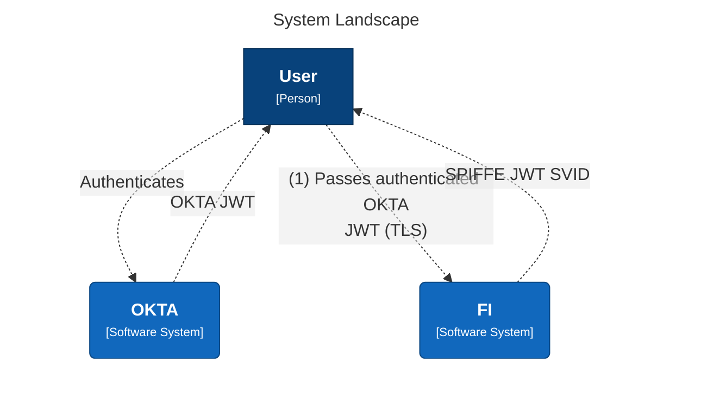
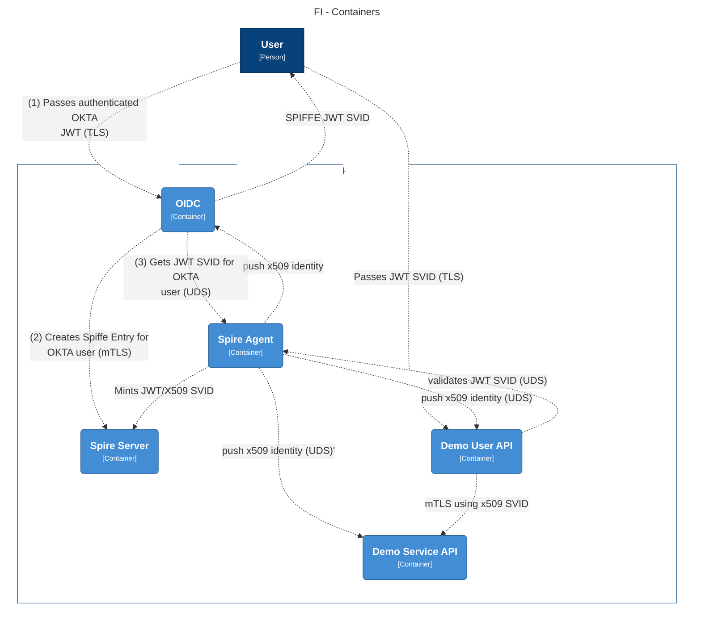

# spiffe

This is a TypeScript library for interacting with Spire using the SPIFFE framework. More details here https://spiffe.io

There are 3 projects,

## spiffe-typescript 
A package library that can be imported into TypeScript projects
Supported Spire APIs

WorkloadAPI (Spire Agent Public APIs)
- FetchX509SVID
- FetchX509Bundles
- FetchJWTSVID
- FetchJWTBundles
- ValidateJWTSVID

Entry (Spire Server Admin APIs)
- BatchCreateEntry

DelegatedIdentity (Spire Agent Admin APIs)
- FetchJWTSVIDs

## spiffe-oidc
A NestJS based service (workload) that integrates into an OKTA IdP for user authentication, which can create Spire Users (SpiffeId) and issue Spire JWTs to use against other services (workloads). Integration into Spire is based on spiffe-typescript library

## spiffe-demo-workload-public
A NestJS based service (workload) that authenticates against Spire using JWT SVID.  Integration into Spire is based on spiffe-typescript library

## spiffe-demo-service
A NestJS based service (workload) that is designed to be accessed by other services using mTLS issused by Spire.  Integration into Spire is based on spiffe-typescript library

## Notes
To communicate to the agent sock, both the caller and agent must be in the same group or share the same userid

For the agent to communicate to the docker socket, it must run as a root user (0:0) and maybe run privileged

**Further setup specifics** \
[Infrastructure](spire/README.md) \
[Demo API based Service](spiffe-demo-service/README.md) \
[Demo user based Service](spiffe-demo-workload-public/README.md) \
[OIDC based Interface between OKTA and SPIFFE](spiffe-oidc/README.md) \
[TypeScript SDK for Spiffe](spiffe-typescript/README.md) 

## Diagrams

### C1

### C2
